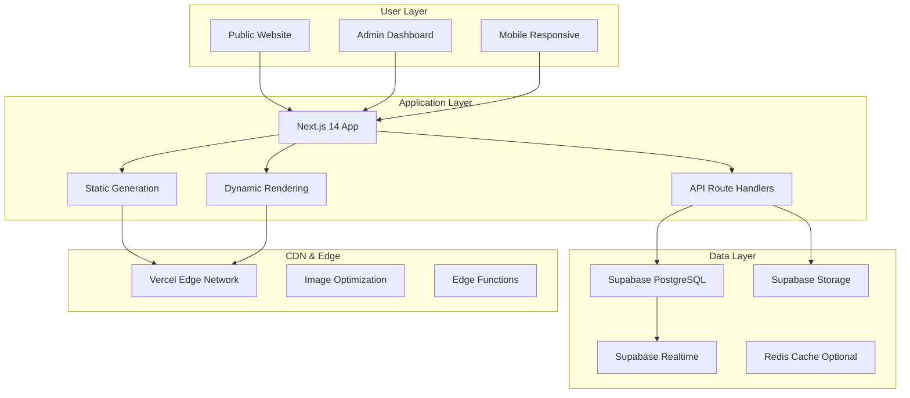

# 씨엠웨이(주) 완전 관리형 CMS 건강식품 플랫폼 PRD
## Product Requirements Document v2.0 - Full CMS Control

---

## 📋 문서 정보

| 항목 | 내용 |
|-----|------|
| **프로젝트명** | CMWay Fully-Managed CMS Platform |
| **버전** | 2.0.0 |
| **작성일** | 2025-01-06 |
| **기술 스택** | Next.js 14 (App Router), Supabase, TypeScript, Tailwind CSS |
| **배포** | Vercel (SSL 자동 제공) |
| **버전 관리** | GitHub |
| **핵심 특징** | 100% 관리자 제어 가능한 No-Code CMS |

---

## 🎯 1. 프로젝트 개요

### 1.1 핵심 목표
```yaml
primary_goal: "오프라인 방문판매 중심의 신뢰감 있는 건강식품 본사 홈페이지"

key_principles:
  - "모든 텍스트, 이미지, 설정이 DB에서 관리"
  - "코드 수정 없이 사이트 구조 변경 가능"
  - "프리미엄 브랜드 이미지 구축"
  - "고객 신뢰도 극대화"
  - "애니메이션을 통한 현대적 UX"
  - "온라인 판매 없이 제품 소개와 상담 중심"

business_positioning:
  - "건강식품 전문 기업 이미지"
  - "오프라인 방문판매 전문"
  - "프리미엄 제품 라인업"
  - "전문성과 신뢰성 강조"
  - "1:1 맞춤 상담 서비스"
```

### 1.2 Zero-Code 운영 철학
```yaml
operational_goals:
  everything_editable:
    - "사이트명부터 푸터 카피라이트까지"
    - "메뉴 구조와 카테고리 계층"
    - "모든 페이지의 레이아웃과 컨텐츠"
    - "SEO, OpenGraph, 메타데이터"
    - "애니메이션 효과와 트랜지션"
    - "색상, 폰트, 스페이싱 등 디자인 토큰"
```

---

## 🏗️ 2. 시스템 아키텍처

### 2.1 기술 스택 상세
```typescript
interface TechStack {
  frontend: {
    framework: "Next.js 14 App Router";
    language: "TypeScript 5.3+";
    styling: {
      base: "Tailwind CSS 3.4";
      animations: "Framer Motion";
      icons: "Lucide Icons";
    };
    state: "Zustand + React Query";
    forms: "React Hook Form + Zod";
  };
  
  backend: {
    database: "Supabase (PostgreSQL)";
    auth: "Supabase Auth";
    storage: "Supabase Storage";
    realtime: "Supabase Realtime";
    api: "Next.js Route Handlers";
  };
  
  deployment: {
    hosting: "Vercel";
    cdn: "Vercel Edge Network";
    ssl: "Vercel 자동 SSL";
    analytics: "Vercel Analytics";
  };
  
  development: {
    versionControl: "GitHub";
    ci_cd: "GitHub Actions → Vercel";
    monitoring: "Vercel + Sentry";
  };
}
```

### 2.2 시스템 구성도


---

## 💾 3. CMS 중심 데이터베이스 스키마

### 3.1 사이트 설정 및 메타데이터
```sql
-- =============================================
-- 사이트 전역 설정 (단일 레코드로 모든 설정 관리)
-- =============================================
CREATE TABLE site_settings (
  id UUID PRIMARY KEY DEFAULT gen_random_uuid(),
  
  -- 기본 정보
  site_name JSONB DEFAULT '{"ko": "씨엠웨이", "en": "CMWay"}',
  tagline JSONB DEFAULT '{"ko": "건강한 삶의 동반자", "en": "Your Health Partner"}',
  description JSONB,
  
  -- 로고 및 파비콘
  logo_light TEXT, -- 라이트 모드 로고
  logo_dark TEXT,  -- 다크 모드 로고
  logo_mobile TEXT, -- 모바일 로고
  favicon TEXT,
  og_image TEXT,
  
  -- 회사 정보
  company_info JSONB DEFAULT '{
    "name": "씨엠웨이(주)",
    "ceo": "대표이사명",
    "business_number": "000-00-00000",
    "online_business_number": "제 0000-서울-0000호",
    "address": {
      "ko": "서울특별시 강남구 테헤란로 000",
      "en": "000 Teheran-ro, Gangnam-gu, Seoul"
    },
    "phone": "02-0000-0000",
    "fax": "02-0000-0001",
    "email": "contact@cmway.co.kr",
    "customer_center": {
      "phone": "1588-0000",
      "hours": "평일 09:00 - 18:00",
      "lunch": "12:00 - 13:00",
      "holiday": "토/일/공휴일 휴무"
    }
  }',
  
  -- SEO 기본 설정
  seo_config JSONB DEFAULT '{
    "default_title": "씨엠웨이 - 건강한 삶의 동반자",
    "title_template": "%s | 씨엠웨이",
    "default_description": "프리미엄 건강식품 전문 기업 씨엠웨이입니다.",
    "default_keywords": ["건강식품", "건강기능식품", "홍삼", "비타민"],
    "robots": "index, follow",
    "canonical_domain": "https://cmway.co.kr"
  }',
  
  -- OpenGraph 설정
  og_config JSONB DEFAULT '{
    "og_type": "website",
    "og_site_name": "씨엠웨이",
    "twitter_card": "summary_large_image",
    "twitter_handle": "@cmway_official"
  }',
  
  -- 소셜 미디어 링크
  social_links JSONB DEFAULT '{
    "facebook": "",
    "instagram": "",
    "youtube": "",
    "blog": "",
    "kakao": ""
  }',
  
  -- 써드파티 통합
  integrations JSONB DEFAULT '{
    "google_analytics": "",
    "google_tag_manager": "",
    "naver_site_verification": "",
    "facebook_pixel": "",
    "kakao_sdk_key": "",
    "channel_talk_key": ""
  }',
  
  -- 푸터 설정
  footer_config JSONB DEFAULT '{
    "copyright": "© 2025 CMWay Co., Ltd. All rights reserved.",
    "show_family_sites": true,
    "show_certifications": true,
    "show_payment_methods": true
  }',
  
  -- 디자인 토큰
  design_tokens JSONB DEFAULT '{
    "colors": {
      "primary": "#10B981",
      "secondary": "#3B82F6",
      "accent": "#8B5CF6",
      "success": "#22C55E",
      "warning": "#F59E0B",
      "error": "#EF4444"
    },
    "fonts": {
      "heading": "Pretendard",
      "body": "Noto Sans KR",
      "code": "Fira Code"
    },
    "animations": {
      "enable_scroll": true,
      "enable_hover": true,
      "enable_page_transition": true
    }
  }',
  
  -- 유지보수 모드
  maintenance JSONB DEFAULT '{
    "enabled": false,
    "message": "시스템 점검 중입니다.",
    "expected_time": null
  }',
  
  created_at TIMESTAMPTZ DEFAULT NOW(),
  updated_at TIMESTAMPTZ DEFAULT NOW()
);

-- =============================================
-- 다국어 문구 관리
-- =============================================
CREATE TABLE translations (
  id UUID PRIMARY KEY DEFAULT gen_random_uuid(),
  key TEXT NOT NULL UNIQUE,
  namespace TEXT DEFAULT 'common',
  translations JSONB NOT NULL, -- {"ko": "한글", "en": "English"}
  description TEXT,
  is_rich_text BOOLEAN DEFAULT false,
  created_at TIMESTAMPTZ DEFAULT NOW(),
  updated_at TIMESTAMPTZ DEFAULT NOW()
);

-- 기본 번역 데이터 삽입
INSERT INTO translations (key, namespace, translations) VALUES
  ('nav.home', 'common', '{"ko": "홈", "en": "Home"}'),
  ('nav.products', 'common', '{"ko": "제품소개", "en": "Products"}'),
  ('nav.about', 'common', '{"ko": "회사소개", "en": "About"}'),
  ('nav.contact', 'common', '{"ko": "문의하기", "en": "Contact"}'),
  ('button.inquiry', 'common', '{"ko": "상담 신청", "en": "Request Consultation"}'),
  ('button.contact', 'common', '{"ko": "문의하기", "en": "Contact Us"}');

-- =============================================
-- 동적 메뉴 시스템
-- =============================================
CREATE TABLE menus (
  id UUID PRIMARY KEY DEFAULT gen_random_uuid(),
  menu_location TEXT NOT NULL, -- 'header', 'footer', 'mobile', 'sidebar'
  parent_id UUID REFERENCES menus(id) ON DELETE CASCADE,
  
  -- 메뉴 정보
  title JSONB NOT NULL, -- {"ko": "제품소개", "en": "Products"}
  url TEXT,
  url_type TEXT DEFAULT 'internal', -- 'internal', 'external', 'anchor', 'category', 'page'
  target TEXT DEFAULT '_self',
  
  -- 스타일링
  icon TEXT,
  badge_text TEXT,
  badge_color TEXT,
  css_class TEXT,
  
  -- 메가메뉴 설정
  is_mega_menu BOOLEAN DEFAULT false,
  mega_menu_columns INTEGER DEFAULT 1,
  mega_menu_content JSONB,
  
  -- 표시 조건
  visibility_rules JSONB DEFAULT '{
    "show_logged_in": true,
    "show_logged_out": true,
    "required_roles": [],
    "hide_on_mobile": false
  }',
  
  -- 정렬
  position INTEGER DEFAULT 0,
  is_active BOOLEAN DEFAULT true,
  
  created_at TIMESTAMPTZ DEFAULT NOW(),
  updated_at TIMESTAMPTZ DEFAULT NOW()
);

-- =============================================
-- 페이지 관리 시스템
-- =============================================
CREATE TABLE pages (
  id UUID PRIMARY KEY DEFAULT gen_random_uuid(),
  
  -- 페이지 식별
  slug TEXT UNIQUE NOT NULL,
  template TEXT DEFAULT 'default', -- 'default', 'landing', 'product', 'blog', 'custom'
  page_type TEXT DEFAULT 'static', -- 'static', 'dynamic', 'system'
  
  -- 페이지 메타데이터
  meta JSONB NOT NULL DEFAULT '{
    "title": {"ko": "", "en": ""},
    "description": {"ko": "", "en": ""},
    "keywords": [],
    "og_title": "",
    "og_description": "",
    "og_image": ""
  }',
  
  -- 페이지 설정
  settings JSONB DEFAULT '{
    "show_header": true,
    "show_footer": true,
    "show_breadcrumb": true,
    "container_width": "default",
    "background_color": "",
    "background_image": ""
  }',
  
  -- 페이지 상태
  status TEXT DEFAULT 'draft', -- 'draft', 'published', 'scheduled', 'archived'
  published_at TIMESTAMPTZ,
  scheduled_at TIMESTAMPTZ,
  
  -- 접근 권한
  access_rules JSONB DEFAULT '{
    "require_login": false,
    "allowed_roles": [],
    "redirect_url": "/login"
  }',
  
  -- 애니메이션 설정
  animations JSONB DEFAULT '{
    "page_transition": "fade",
    "scroll_animation": "fade-up",
    "animation_duration": 0.6,
    "stagger_delay": 0.1
  }',
  
  -- 버전 관리
  version INTEGER DEFAULT 1,
  draft_content JSONB,
  published_content JSONB,
  
  created_at TIMESTAMPTZ DEFAULT NOW(),
  updated_at TIMESTAMPTZ DEFAULT NOW(),
  created_by UUID REFERENCES auth.users(id),
  updated_by UUID REFERENCES auth.users(id)
);

-- =============================================
-- 컨텐츠 블록 (재사용 가능한 컴포넌트)
-- =============================================
CREATE TABLE content_blocks (
  id UUID PRIMARY KEY DEFAULT gen_random_uuid(),
  
  -- 블록 정보
  name TEXT NOT NULL,
  type TEXT NOT NULL, -- 아래 상세 타입 참조
  category TEXT, -- 'hero', 'content', 'feature', 'testimonial', 'cta', 'form'
  
  -- 블록 컨텐츠
  content JSONB NOT NULL,
  
  -- 블록별 애니메이션 설정
  animations JSONB DEFAULT '{
    "on_scroll": {
      "enabled": true,
      "type": "fade-up",
      "duration": 0.8,
      "delay": 0,
      "offset": 100
    },
    "on_hover": {
      "enabled": false,
      "type": "scale",
      "scale": 1.05
    }
  }',
  
  -- 반응형 설정
  responsive JSONB DEFAULT '{
    "desktop": {"display": true, "columns": 12},
    "tablet": {"display": true, "columns": 12},
    "mobile": {"display": true, "columns": 12}
  }',
  
  -- 재사용 설정
  is_global BOOLEAN DEFAULT false,
  is_template BOOLEAN DEFAULT false,
  
  created_at TIMESTAMPTZ DEFAULT NOW(),
  updated_at TIMESTAMPTZ DEFAULT NOW()
);

-- 블록 타입 상세
COMMENT ON COLUMN content_blocks.type IS '
블록 타입:
- hero_slider: 메인 히어로 슬라이더
- hero_video: 비디오 배경 히어로
- hero_static: 정적 이미지 히어로
- product_grid: 제품 그리드
- product_carousel: 제품 캐러셀
- product_featured: 추천 제품
- content_text: 텍스트 컨텐츠
- content_image_text: 이미지+텍스트
- content_video: 비디오 컨텐츠
- content_tabs: 탭 컨텐츠
- content_accordion: 아코디언
- feature_grid: 특징 그리드
- feature_list: 특징 리스트
- testimonial_slider: 고객 후기 슬라이더
- testimonial_grid: 고객 후기 그리드
- stat_counter: 숫자 카운터
- cta_banner: CTA 배너
- cta_popup: 팝업 CTA
- form_contact: 문의 폼
- form_newsletter: 뉴스레터 구독
- gallery_grid: 갤러리 그리드
- gallery_masonry: 갤러리 메이슨리
- team_grid: 팀 소개
- faq_accordion: FAQ
- pricing_table: 가격표
- timeline: 타임라인
- blog_grid: 블로그 그리드
- map: 지도
- custom_html: 커스텀 HTML
- custom_code: 커스텀 코드
';

-- =============================================
-- 페이지-블록 연결
-- =============================================
CREATE TABLE page_blocks (
  id UUID PRIMARY KEY DEFAULT gen_random_uuid(),
  page_id UUID REFERENCES pages(id) ON DELETE CASCADE,
  block_id UUID REFERENCES content_blocks(id) ON DELETE CASCADE,
  
  -- 위치 정보
  section TEXT DEFAULT 'main', -- 'header', 'hero', 'main', 'sidebar', 'footer'
  position INTEGER DEFAULT 0,
  
  -- 페이지별 오버라이드
  override_content JSONB,
  override_animations JSONB,
  override_responsive JSONB,
  
  -- 표시 조건
  visibility_rules JSONB DEFAULT '{
    "show_on_desktop": true,
    "show_on_tablet": true,
    "show_on_mobile": true,
    "show_logged_in": true,
    "show_logged_out": true
  }',
  
  is_active BOOLEAN DEFAULT true,
  
  created_at TIMESTAMPTZ DEFAULT NOW()
);

-- =============================================
-- 동적 카테고리 관리
-- =============================================
CREATE TABLE categories (
  id UUID PRIMARY KEY DEFAULT gen_random_uuid(),
  parent_id UUID REFERENCES categories(id) ON DELETE CASCADE,
  
  -- 카테고리 정보
  name JSONB NOT NULL, -- {"ko": "홍삼", "en": "Red Ginseng"}
  slug TEXT UNIQUE NOT NULL,
  description JSONB,
  
  -- 이미지
  thumbnail TEXT,
  banner_image TEXT,
  icon TEXT,
  
  -- SEO
  meta JSONB DEFAULT '{}',
  
  -- 표시 설정
  display_settings JSONB DEFAULT '{
    "show_in_menu": true,
    "show_in_homepage": false,
    "show_in_footer": false,
    "featured": false
  }',
  
  -- 카테고리 페이지 레이아웃
  layout_settings JSONB DEFAULT '{
    "products_per_page": 12,
    "default_view": "grid",
    "show_filters": true,
    "show_sorting": true
  }',
  
  -- 커스텀 필드
  custom_fields JSONB DEFAULT '{}',
  
  -- 정렬 및 경로
  position INTEGER DEFAULT 0,
  path TEXT, -- '/health/supplements/vitamins'
  level INTEGER DEFAULT 0,
  
  is_active BOOLEAN DEFAULT true,
  
  created_at TIMESTAMPTZ DEFAULT NOW(),
  updated_at TIMESTAMPTZ DEFAULT NOW()
);

-- =============================================
-- 제품 소개 (온라인 판매 없음)
-- =============================================
CREATE TABLE products (
  id UUID PRIMARY KEY DEFAULT gen_random_uuid(),
  
  -- 제품 기본 정보
  sku TEXT UNIQUE NOT NULL,
  barcode TEXT,
  name JSONB NOT NULL,
  slug TEXT UNIQUE NOT NULL,
  
  -- 제품 설명
  short_description JSONB,
  description JSONB,
  features JSONB, -- 주요 특징 리스트
  benefits JSONB, -- 효능/효과
  usage JSONB, -- 섭취 방법
  
  -- 카테고리
  primary_category_id UUID REFERENCES categories(id),
  category_ids UUID[],
  
  -- 브랜드
  brand_id UUID REFERENCES brands(id),
  
  -- 가격 표시 (참고용, 판매는 오프라인)
  pricing JSONB DEFAULT '{
    "display_price": null,
    "price_text": "가격 문의",
    "is_price_visible": false
  }',
  
  -- 이미지/미디어
  media JSONB DEFAULT '{
    "featured_image": null,
    "gallery": [],
    "videos": [],
    "360_view": null,
    "documents": []
  }',
  
  -- 제품 상세 정보
  specifications JSONB, -- 제품 사양
  ingredients JSONB, -- 원재료
  nutrition_facts JSONB, -- 영양 정보
  certifications JSONB, -- 인증 정보
  
  -- 품질 인증
  quality JSONB DEFAULT '{
    "gmp_certified": false,
    "haccp_certified": false,
    "organic_certified": false,
    "other_certifications": []
  }',
  
  -- SEO
  seo JSONB DEFAULT '{}',
  
  -- 문의 설정
  inquiry_settings JSONB DEFAULT '{
    "enable_inquiry": true,
    "inquiry_button_text": "제품 문의하기",
    "show_kakao_chat": true,
    "show_phone_number": true
  }',
  
  -- 관련 상품
  related_products JSONB DEFAULT '{
    "cross_sells": [],
    "up_sells": [],
    "frequently_bought": []
  }',
  
  -- 상태
  status TEXT DEFAULT 'draft', -- 'draft', 'published', 'out_of_stock'
  featured BOOLEAN DEFAULT false,
  is_new BOOLEAN DEFAULT false,
  is_best BOOLEAN DEFAULT false,
  
  -- 통계
  stats JSONB DEFAULT '{
    "view_count": 0,
    "inquiry_count": 0,
    "brochure_download_count": 0
  }',
  
  -- 커스텀 필드
  custom_fields JSONB DEFAULT '{}',
  
  created_at TIMESTAMPTZ DEFAULT NOW(),
  updated_at TIMESTAMPTZ DEFAULT NOW(),
  published_at TIMESTAMPTZ
);

-- =============================================
-- 브랜드 관리
-- =============================================
CREATE TABLE brands (
  id UUID PRIMARY KEY DEFAULT gen_random_uuid(),
  name JSONB NOT NULL,
  slug TEXT UNIQUE NOT NULL,
  logo TEXT,
  description JSONB,
  website TEXT,
  
  -- 브랜드 스토리
  story JSONB,
  values JSONB, -- 브랜드 가치
  
  -- 표시 설정
  is_featured BOOLEAN DEFAULT false,
  is_active BOOLEAN DEFAULT true,
  position INTEGER DEFAULT 0,
  
  created_at TIMESTAMPTZ DEFAULT NOW(),
  updated_at TIMESTAMPTZ DEFAULT NOW()
);

-- =============================================
-- 상담 예약 시스템
-- =============================================
CREATE TABLE consultation_requests (
  id UUID PRIMARY KEY DEFAULT gen_random_uuid(),
  
  -- 신청자 정보
  name TEXT NOT NULL,
  phone TEXT NOT NULL,
  email TEXT,
  company TEXT,
  
  -- 상담 내용
  consultation_type TEXT, -- '방문상담', '전화상담', '화상상담'
  preferred_date DATE,
  preferred_time TEXT,
  product_interests UUID[], -- 관심 제품
  message TEXT,
  
  -- 상태
  status TEXT DEFAULT 'pending', -- 'pending', 'confirmed', 'completed', 'cancelled'
  assigned_to UUID REFERENCES auth.users(id),
  
  -- 노트
  admin_notes TEXT,
  consultation_result TEXT,
  
  -- 마케팅 동의
  marketing_agreed BOOLEAN DEFAULT false,
  privacy_agreed BOOLEAN DEFAULT true,
  
  created_at TIMESTAMPTZ DEFAULT NOW(),
  updated_at TIMESTAMPTZ DEFAULT NOW()
);

-- =============================================
-- 매장/지점 정보
-- =============================================
CREATE TABLE store_locations (
  id UUID PRIMARY KEY DEFAULT gen_random_uuid(),
  
  -- 매장 정보
  name JSONB NOT NULL,
  type TEXT, -- 'headquarters', 'branch', 'partner'
  
  -- 주소
  address JSONB NOT NULL,
  latitude DECIMAL(10, 8),
  longitude DECIMAL(11, 8),
  
  -- 연락처
  phone TEXT,
  fax TEXT,
  email TEXT,
  
  -- 운영 시간
  business_hours JSONB,
  holiday_info TEXT,
  
  -- 시설 정보
  facilities JSONB, -- 주차, 상담실, 전시장 등
  
  -- 이미지
  images JSONB,
  
  -- 교통 안내
  transportation JSONB,
  
  is_active BOOLEAN DEFAULT true,
  display_order INTEGER DEFAULT 0,
  
  created_at TIMESTAMPTZ DEFAULT NOW(),
  updated_at TIMESTAMPTZ DEFAULT NOW()
);

-- =============================================
-- 제품 카탈로그 다운로드
-- =============================================
CREATE TABLE catalog_downloads (
  id UUID PRIMARY KEY DEFAULT gen_random_uuid(),
  
  -- 다운로드 신청자
  name TEXT,
  email TEXT,
  phone TEXT,
  company TEXT,
  
  -- 다운로드 정보
  catalog_type TEXT, -- '전체', '특정카테고리'
  download_url TEXT,
  
  -- 마케팅 동의
  marketing_agreed BOOLEAN DEFAULT false,
  
  -- 추적
  ip_address INET,
  user_agent TEXT,
  
  created_at TIMESTAMPTZ DEFAULT NOW()
);

-- =============================================
-- 방문 판매원 관리
-- =============================================
CREATE TABLE sales_representatives (
  id UUID PRIMARY KEY DEFAULT gen_random_uuid(),
  user_id UUID REFERENCES auth.users(id),
  
  -- 판매원 정보
  name TEXT NOT NULL,
  employee_id TEXT UNIQUE,
  phone TEXT,
  email TEXT,
  
  -- 담당 구역
  assigned_regions JSONB,
  
  -- 소개 페이지
  profile_image TEXT,
  introduction JSONB,
  specialties JSONB, -- 전문 분야
  
  -- 실적
  total_clients INTEGER DEFAULT 0,
  years_of_experience INTEGER,
  
  is_active BOOLEAN DEFAULT true,
  display_order INTEGER DEFAULT 0,
  
  created_at TIMESTAMPTZ DEFAULT NOW(),
  updated_at TIMESTAMPTZ DEFAULT NOW()
);

-- =============================================
-- 배너/팝업 관리
-- =============================================
CREATE TABLE banners (
  id UUID PRIMARY KEY DEFAULT gen_random_uuid(),
  
  -- 배너 정보
  name TEXT NOT NULL,
  type TEXT NOT NULL, -- 'hero', 'promotion', 'notice', 'popup', 'modal'
  
  -- 컨텐츠
  content JSONB NOT NULL, -- 제목, 부제목, 설명, 버튼 등
  media JSONB, -- 이미지, 비디오 URL
  
  -- 링크
  link_url TEXT,
  link_target TEXT DEFAULT '_self',
  
  -- 표시 규칙
  display_rules JSONB DEFAULT '{
    "pages": [],
    "start_date": null,
    "end_date": null,
    "show_once": false,
    "cookie_days": 1,
    "trigger": "immediate",
    "trigger_value": 0
  }',
  
  -- 타겟팅
  targeting JSONB DEFAULT '{
    "devices": ["desktop", "tablet", "mobile"],
    "user_types": ["all"],
    "languages": ["ko"]
  }',
  
  -- 스타일
  styles JSONB DEFAULT '{}',
  
  -- 애니메이션
  animations JSONB DEFAULT '{
    "entrance": "fadeIn",
    "exit": "fadeOut",
    "duration": 0.5
  }',
  
  priority INTEGER DEFAULT 0,
  is_active BOOLEAN DEFAULT true,
  
  -- 통계
  impressions INTEGER DEFAULT 0,
  clicks INTEGER DEFAULT 0,
  
  created_at TIMESTAMPTZ DEFAULT NOW(),
  updated_at TIMESTAMPTZ DEFAULT NOW()
);

-- =============================================
-- 폼 빌더
-- =============================================
CREATE TABLE forms (
  id UUID PRIMARY KEY DEFAULT gen_random_uuid(),
  
  -- 폼 정보
  name TEXT NOT NULL,
  slug TEXT UNIQUE NOT NULL,
  description TEXT,
  
  -- 폼 구조
  fields JSONB NOT NULL, -- 필드 정의
  validation_rules JSONB,
  
  -- 제출 설정
  submit_settings JSONB DEFAULT '{
    "button_text": {"ko": "제출", "en": "Submit"},
    "success_message": {"ko": "감사합니다.", "en": "Thank you."},
    "error_message": {"ko": "오류가 발생했습니다.", "en": "An error occurred."},
    "redirect_url": null,
    "send_email": true,
    "email_to": [],
    "save_to_db": true
  }',
  
  -- 스팸 방지
  anti_spam JSONB DEFAULT '{
    "honeypot": true,
    "recaptcha": false,
    "recaptcha_key": null
  }',
  
  is_active BOOLEAN DEFAULT true,
  
  created_at TIMESTAMPTZ DEFAULT NOW(),
  updated_at TIMESTAMPTZ DEFAULT NOW()
);

-- =============================================
-- 폼 제출 데이터
-- =============================================
CREATE TABLE form_submissions (
  id UUID PRIMARY KEY DEFAULT gen_random_uuid(),
  form_id UUID REFERENCES forms(id),
  
  -- 제출 데이터
  data JSONB NOT NULL,
  
  -- 제출자 정보
  user_id UUID REFERENCES auth.users(id),
  ip_address INET,
  user_agent TEXT,
  referer TEXT,
  
  -- 상태
  status TEXT DEFAULT 'new', -- 'new', 'read', 'replied', 'spam'
  notes TEXT,
  
  created_at TIMESTAMPTZ DEFAULT NOW()
);

-- =============================================
-- 미디어 라이브러리
-- =============================================
CREATE TABLE media (
  id UUID PRIMARY KEY DEFAULT gen_random_uuid(),
  
  -- 파일 정보
  filename TEXT NOT NULL,
  original_name TEXT,
  mime_type TEXT,
  size_bytes BIGINT,
  
  -- 저장 정보
  storage_path TEXT NOT NULL,
  public_url TEXT,
  cdn_url TEXT,
  
  -- 썸네일
  thumbnails JSONB, -- 다양한 크기의 썸네일 URL
  
  -- 메타데이터
  alt_text JSONB, -- 다국어 alt 텍스트
  caption JSONB, -- 다국어 캡션
  description JSONB,
  
  -- 이미지 정보
  dimensions JSONB, -- width, height
  
  -- 폴더 구조
  folder_path TEXT DEFAULT '/',
  tags TEXT[],
  
  -- 사용 추적
  used_in JSONB DEFAULT '[]', -- 사용된 위치 추적
  
  uploaded_by UUID REFERENCES auth.users(id),
  created_at TIMESTAMPTZ DEFAULT NOW()
);

-- =============================================
-- 리다이렉트 관리
-- =============================================
CREATE TABLE redirects (
  id UUID PRIMARY KEY DEFAULT gen_random_uuid(),
  from_path TEXT UNIQUE NOT NULL,
  to_path TEXT NOT NULL,
  type INTEGER DEFAULT 301, -- 301: permanent, 302: temporary
  
  -- 통계
  hit_count INTEGER DEFAULT 0,
  last_hit_at TIMESTAMPTZ,
  
  is_active BOOLEAN DEFAULT true,
  created_at TIMESTAMPTZ DEFAULT NOW()
);

-- =============================================
-- 커스텀 코드 인젝션
-- =============================================
CREATE TABLE code_injections (
  id UUID PRIMARY KEY DEFAULT gen_random_uuid(),
  
  name TEXT NOT NULL,
  location TEXT NOT NULL, -- 'head', 'body_start', 'body_end'
  code TEXT NOT NULL,
  
  -- 적용 규칙
  apply_rules JSONB DEFAULT '{
    "pages": [],
    "exclude_pages": [],
    "user_types": ["all"]
  }',
  
  priority INTEGER DEFAULT 0,
  is_active BOOLEAN DEFAULT true,
  
  created_at TIMESTAMPTZ DEFAULT NOW()
);

-- =============================================
-- 이메일 템플릿
-- =============================================
CREATE TABLE email_templates (
  id UUID PRIMARY KEY DEFAULT gen_random_uuid(),
  
  -- 템플릿 정보
  name TEXT NOT NULL,
  slug TEXT UNIQUE NOT NULL,
  type TEXT NOT NULL, -- 'transactional', 'marketing', 'notification'
  
  -- 템플릿 컨텐츠
  subject JSONB NOT NULL,
  html_content TEXT,
  text_content TEXT,
  
  -- 변수
  variables JSONB, -- 사용 가능한 변수 목록
  
  -- 발신 정보
  from_name TEXT,
  from_email TEXT,
  reply_to TEXT,
  
  is_active BOOLEAN DEFAULT true,
  
  created_at TIMESTAMPTZ DEFAULT NOW(),
  updated_at TIMESTAMPTZ DEFAULT NOW()
);

-- =============================================
-- 위젯 관리
-- =============================================
CREATE TABLE widgets (
  id UUID PRIMARY KEY DEFAULT gen_random_uuid(),
  
  -- 위젯 정보
  name TEXT NOT NULL,
  type TEXT NOT NULL, -- 'recent_products', 'newsletter', 'social', etc.
  
  -- 위젯 설정
  config JSONB DEFAULT '{}',
  content JSONB,
  
  -- 표시 위치
  zones TEXT[], -- 적용 가능한 존
  
  -- 표시 규칙
  display_rules JSONB,
  
  position INTEGER DEFAULT 0,
  is_active BOOLEAN DEFAULT true,
  
  created_at TIMESTAMPTZ DEFAULT NOW(),
  updated_at TIMESTAMPTZ DEFAULT NOW()
);

-- =============================================
-- 활동 로그 (감사)
-- =============================================
CREATE TABLE activity_logs (
  id UUID PRIMARY KEY DEFAULT gen_random_uuid(),
  
  -- 활동 정보
  user_id UUID REFERENCES auth.users(id),
  action TEXT NOT NULL, -- 'create', 'update', 'delete', 'publish', etc.
  entity_type TEXT NOT NULL,
  entity_id UUID,
  entity_name TEXT,
  
  -- 변경 내용
  changes JSONB,
  
  -- 컨텍스트
  ip_address INET,
  user_agent TEXT,
  
  created_at TIMESTAMPTZ DEFAULT NOW()
);

-- =============================================
-- 커스텀 필드 정의
-- =============================================
CREATE TABLE custom_field_definitions (
  id UUID PRIMARY KEY DEFAULT gen_random_uuid(),
  
  -- 필드 정보
  entity_type TEXT NOT NULL, -- 'product', 'category', 'page', etc.
  field_name TEXT NOT NULL,
  field_type TEXT NOT NULL, -- 'text', 'number', 'date', 'select', etc.
  
  -- 필드 설정
  field_config JSONB NOT NULL, -- 라벨, 설명, 옵션 등
  validation_rules JSONB,
  
  -- UI 설정
  ui_config JSONB DEFAULT '{}',
  
  position INTEGER DEFAULT 0,
  is_required BOOLEAN DEFAULT false,
  is_active BOOLEAN DEFAULT true,
  
  created_at TIMESTAMPTZ DEFAULT NOW(),
  updated_at TIMESTAMPTZ DEFAULT NOW(),
  
  UNIQUE(entity_type, field_name)
);

-- =============================================
-- 대시보드 위젯 (관리자용)
-- =============================================
CREATE TABLE dashboard_widgets (
  id UUID PRIMARY KEY DEFAULT gen_random_uuid(),
  user_id UUID REFERENCES auth.users(id),
  
  -- 위젯 정보
  widget_type TEXT NOT NULL, -- 'stats', 'chart', 'recent_orders', etc.
  title TEXT,
  
  -- 위치 및 크기
  grid_position JSONB DEFAULT '{
    "x": 0, "y": 0, "w": 2, "h": 2
  }',
  
  -- 위젯 설정
  config JSONB DEFAULT '{}',
  refresh_interval INTEGER, -- seconds
  
  is_visible BOOLEAN DEFAULT true,
  
  created_at TIMESTAMPTZ DEFAULT NOW(),
  updated_at TIMESTAMPTZ DEFAULT NOW()
);

-- =============================================
-- 버전 관리
-- =============================================
CREATE TABLE content_versions (
  id UUID PRIMARY KEY DEFAULT gen_random_uuid(),
  
  -- 버전 정보
  entity_type TEXT NOT NULL,
  entity_id UUID NOT NULL,
  version_number INTEGER NOT NULL,
  
  -- 버전 데이터
  content JSONB NOT NULL,
  
  -- 메타데이터
  change_summary TEXT,
  is_published BOOLEAN DEFAULT false,
  published_at TIMESTAMPTZ,
  
  created_by UUID REFERENCES auth.users(id),
  created_at TIMESTAMPTZ DEFAULT NOW(),
  
  UNIQUE(entity_type, entity_id, version_number)
);

-- =============================================
-- 인덱스 생성
-- =============================================
CREATE INDEX idx_pages_slug ON pages(slug);
CREATE INDEX idx_pages_status ON pages(status);
CREATE INDEX idx_products_slug ON products(slug);
CREATE INDEX idx_products_status ON products(status);
CREATE INDEX idx_products_sku ON products(sku);
CREATE INDEX idx_categories_slug ON categories(slug);
CREATE INDEX idx_categories_path ON categories(path);
CREATE INDEX idx_menus_location ON menus(menu_location);
CREATE INDEX idx_banners_type ON banners(type);
CREATE INDEX idx_media_folder ON media(folder_path);
CREATE INDEX idx_activity_logs_user ON activity_logs(user_id);
CREATE INDEX idx_activity_logs_entity ON activity_logs(entity_type, entity_id);

-- =============================================
-- 트리거 함수
-- =============================================
CREATE OR REPLACE FUNCTION update_updated_at()
RETURNS TRIGGER AS $$
BEGIN
  NEW.updated_at = NOW();
  RETURN NEW;
END;
$$ LANGUAGE plpgsql;

-- 트리거 적용
CREATE TRIGGER update_site_settings_updated_at BEFORE UPDATE ON site_settings
  FOR EACH ROW EXECUTE FUNCTION update_updated_at();

CREATE TRIGGER update_pages_updated_at BEFORE UPDATE ON pages
  FOR EACH ROW EXECUTE FUNCTION update_updated_at();

CREATE TRIGGER update_products_updated_at BEFORE UPDATE ON products
  FOR EACH ROW EXECUTE FUNCTION update_updated_at();

-- =============================================
-- Row Level Security 정책
-- =============================================

-- 사이트 설정은 모두 읽기 가능, 관리자만 수정
ALTER TABLE site_settings ENABLE ROW LEVEL SECURITY;

CREATE POLICY "Site settings readable by all"
  ON site_settings FOR SELECT
  USING (true);

CREATE POLICY "Site settings editable by admins"
  ON site_settings FOR ALL
  USING (auth.uid() IN (
    SELECT id FROM auth.users WHERE raw_user_meta_data->>'role' = 'admin'
  ));

-- 페이지는 발행된 것만 공개
ALTER TABLE pages ENABLE ROW LEVEL SECURITY;

CREATE POLICY "Published pages readable by all"
  ON pages FOR SELECT
  USING (status = 'published' OR auth.uid() IN (
    SELECT id FROM auth.users WHERE raw_user_meta_data->>'role' IN ('admin', 'editor')
  ));

-- 제품은 발행된 것만 공개
ALTER TABLE products ENABLE ROW LEVEL SECURITY;

CREATE POLICY "Published products readable by all"
  ON products FOR SELECT
  USING (status = 'published' OR auth.uid() IN (
    SELECT id FROM auth.users WHERE raw_user_meta_data->>'role' IN ('admin', 'editor')
  ));
```

---

## 🎨 4. 프론트엔드 구현 전략

### 4.1 Next.js 14 App Router 구조
```typescript
// app 디렉토리 구조
interface AppStructure {
  "app/": {
    "layout.tsx": "루트 레이아웃 (헤더/푸터 포함)";
    "page.tsx": "홈페이지 (동적 블록 렌더링)";
    "globals.css": "Tailwind CSS";
    
    "(public)/": {
      "products/": {
        "page.tsx": "제품 목록 (동적)";
        "[slug]/page.tsx": "제품 상세 (동적)";
      };
      "categories/": {
        "[...slug]/page.tsx": "카테고리 페이지 (동적)";
      };
      "[...slug]/page.tsx": "동적 페이지 (CMS 페이지)";
    };
    
    "(auth)/": {
      "login/page.tsx": "로그인";
      "register/page.tsx": "회원가입";
      "forgot-password/page.tsx": "비밀번호 찾기";
    };
    
    "(protected)/": {
      "account/": {
        "layout.tsx": "계정 레이아웃";
        "page.tsx": "대시보드";
        "consultations/page.tsx": "상담 내역";
        "downloads/page.tsx": "다운로드 자료";
        "profile/page.tsx": "프로필";
      };
    };
    
    "admin/": {
      "layout.tsx": "관리자 레이아웃";
      "page.tsx": "관리자 대시보드";
      
      "site/": {
        "settings/page.tsx": "사이트 설정";
        "menus/page.tsx": "메뉴 관리";
        "translations/page.tsx": "번역 관리";
      };
      
      "content/": {
        "pages/page.tsx": "페이지 관리";
        "blocks/page.tsx": "블록 관리";
        "media/page.tsx": "미디어 라이브러리";
      };
      
      "products/": {
        "list/page.tsx": "제품 관리";
        "categories/page.tsx": "카테고리 관리";
      };
      
      "consultations/": {
        "requests/page.tsx": "상담 요청 관리";
        "schedule/page.tsx": "상담 일정";
        "representatives/page.tsx": "판매원 관리";
      };
      
      "stores/": {
        "locations/page.tsx": "매장 관리";
      };
      
      "marketing/": {
        "banners/page.tsx": "배너 관리";
        "forms/page.tsx": "폼 관리";
        "emails/page.tsx": "이메일 템플릿";
      };
    };
    
    "api/": {
      "cms/": {
        "[...path]/route.ts": "CMS API 라우트";
      };
      "auth/": {
        "[...supabase]/route.ts": "Supabase Auth";
      };
    };
  };
}
```

### 4.2 컴포넌트 아키텍처
```typescript
// 컴포넌트 구조
interface ComponentArchitecture {
  "components/": {
    "cms/": {
      "BlockRenderer": "동적 블록 렌더러";
      "PageBuilder": "페이지 빌더 컴포넌트";
      "ContentEditor": "인라인 컨텐츠 편집기";
    };
    
    "blocks/": {
      "HeroSlider": "히어로 슬라이더";
      "ProductGrid": "제품 그리드";
      "ContentSection": "컨텐츠 섹션";
      "Testimonials": "고객 후기";
      "FAQ": "자주 묻는 질문";
      "Newsletter": "뉴스레터 구독";
      // ... 모든 블록 타입
    };
    
    "ui/": {
      "Button": "버튼 컴포넌트";
      "Card": "카드 컴포넌트";
      "Modal": "모달 컴포넌트";
      "Form": "폼 컴포넌트";
      "Table": "테이블 컴포넌트";
    };
    
    "layout/": {
      "Header": "동적 헤더";
      "Footer": "동적 푸터";
      "Navigation": "동적 네비게이션";
      "MegaMenu": "메가 메뉴";
    };
    
    "animations/": {
      "ScrollAnimation": "스크롤 애니메이션";
      "PageTransition": "페이지 전환";
      "HoverEffect": "호버 효과";
      "CountUp": "숫자 카운터";
    };
  };
}
```

### 4.3 애니메이션 시스템
```typescript
// 애니메이션 설정
interface AnimationSystem {
  scrollAnimations: {
    fadeIn: "페이드 인";
    fadeUp: "아래에서 위로 페이드";
    fadeDown: "위에서 아래로 페이드";
    fadeLeft: "왼쪽에서 페이드";
    fadeRight: "오른쪽에서 페이드";
    zoomIn: "줌 인";
    zoomOut: "줌 아웃";
    rotate: "회전";
    flip: "플립";
  };
  
  hoverEffects: {
    scale: "크기 변화";
    rotate: "회전";
    shadow: "그림자 효과";
    glow: "글로우 효과";
    shake: "흔들기";
    pulse: "펄스";
  };
  
  pageTransitions: {
    fade: "페이드";
    slide: "슬라이드";
    zoom: "줌";
    flip: "플립";
  };
  
  microInteractions: {
    buttonClick: "버튼 클릭 효과";
    formFocus: "폼 포커스 효과";
    loadingSpinner: "로딩 스피너";
    successCheck: "성공 체크 애니메이션";
  };
}

// Framer Motion 애니메이션 프리셋
const animationPresets = {
  fadeUp: {
    initial: { opacity: 0, y: 20 },
    animate: { opacity: 1, y: 0 },
    transition: { duration: 0.6 }
  },
  
  stagger: {
    container: {
      animate: {
        transition: {
          staggerChildren: 0.1
        }
      }
    },
    item: {
      initial: { opacity: 0, y: 20 },
      animate: { opacity: 1, y: 0 }
    }
  },
  
  parallax: {
    y: [0, -50],
    transition: { duration: 0 }
  }
};
```

---

## 🔐 5. 관리자 패널 기능

### 5.1 비주얼 페이지 빌더
```typescript
interface PageBuilder {
  features: {
    dragAndDrop: {
      blocks: "블록 드래그앤드롭";
      reorder: "순서 변경";
      nested: "중첩 구조 지원";
    };
    
    livePreview: {
      desktop: "데스크톱 미리보기";
      tablet: "태블릿 미리보기";
      mobile: "모바일 미리보기";
      realtime: "실시간 업데이트";
    };
    
    contentEditing: {
      inline: "인라인 편집";
      wysiwyg: "WYSIWYG 에디터";
      markdown: "마크다운 지원";
      codeEditor: "코드 에디터";
    };
    
    blockLibrary: {
      prebuilt: "사전 제작 블록";
      custom: "커스텀 블록";
      saved: "저장된 블록";
      global: "전역 블록";
    };
    
    responsive: {
      breakpoints: "브레이크포인트 설정";
      hideShow: "디바이스별 표시/숨김";
      customCSS: "반응형 CSS";
    };
  };
}
```

### 5.2 사이트 설정 관리
```typescript
interface SiteSettingsManager {
  general: {
    siteName: "사이트명 변경";
    logo: {
      light: "라이트 모드 로고";
      dark: "다크 모드 로고";
      mobile: "모바일 로고";
    };
    favicon: "파비콘 업로드";
    businessInfo: "사업자 정보";
  };
  
  seo: {
    metaTags: "메타 태그 템플릿";
    openGraph: "OpenGraph 설정";
    twitterCard: "Twitter 카드";
    schema: "구조화된 데이터";
    sitemap: "사이트맵 생성";
    robots: "robots.txt 편집";
  };
  
  design: {
    colors: "색상 팔레트";
    typography: "타이포그래피";
    spacing: "여백 시스템";
    animations: "애니메이션 설정";
    customCSS: "커스텀 CSS";
  };
  
  integrations: {
    analytics: "Google Analytics";
    tagManager: "Google Tag Manager";
    pixel: "Facebook Pixel";
    chat: "채팅 도구";
    marketing: "마케팅 도구";
  };
}
```

### 5.3 메뉴 빌더
```typescript
interface MenuBuilder {
  features: {
    structure: {
      dragDrop: "드래그앤드롭 구조 변경";
      unlimited: "무제한 레벨";
      megaMenu: "메가 메뉴 지원";
    };
    
    items: {
      pages: "페이지 링크";
      categories: "카테고리 링크";
      custom: "커스텀 링크";
      anchor: "앵커 링크";
    };
    
    styling: {
      icons: "아이콘 추가";
      badges: "배지 (NEW, HOT)";
      colors: "색상 커스터마이징";
      fonts: "폰트 설정";
    };
    
    conditions: {
      loggedIn: "로그인 사용자만";
      loggedOut: "비로그인 사용자만";
      roles: "특정 역할만";
      devices: "특정 디바이스만";
    };
  };
}
```

---

## 🚀 6. 배포 및 인프라

### 6.1 Vercel 배포 설정
```yaml
# vercel.json
{
  "framework": "nextjs",
  "buildCommand": "npm run build",
  "devCommand": "npm run dev",
  "installCommand": "npm install",
  "regions": ["icn1"], # 서울 리전
  
  "env": {
    "NEXT_PUBLIC_SUPABASE_URL": "@supabase_url",
    "NEXT_PUBLIC_SUPABASE_ANON_KEY": "@supabase_anon_key",
    "SUPABASE_SERVICE_KEY": "@supabase_service_key"
  },
  
  "headers": [
    {
      "source": "/(.*)",
      "headers": [
        {
          "key": "X-Content-Type-Options",
          "value": "nosniff"
        },
        {
          "key": "X-Frame-Options",
          "value": "SAMEORIGIN"
        },
        {
          "key": "X-XSS-Protection",
          "value": "1; mode=block"
        }
      ]
    }
  ]
}
```

### 6.2 환경 변수
```bash
# .env.local
# Supabase
NEXT_PUBLIC_SUPABASE_URL=https://[PROJECT_ID].supabase.co
NEXT_PUBLIC_SUPABASE_ANON_KEY=[ANON_KEY]
SUPABASE_SERVICE_KEY=[SERVICE_KEY]

# Site URL
NEXT_PUBLIC_SITE_URL=https://cmway.co.kr

# Vercel
VERCEL_URL=$VERCEL_URL

# Optional: Redis (for caching)
REDIS_URL=[REDIS_URL]

# Optional: Sentry (for error tracking)
SENTRY_DSN=[SENTRY_DSN]
```

---

## 📊 7. 성능 최적화

### 7.1 Next.js 최적화
```typescript
interface PerformanceOptimization {
  rendering: {
    staticGeneration: "정적 페이지 생성";
    incrementalStatic: "ISR 활용";
    dynamicRendering: "필요시 동적 렌더링";
    streaming: "React Streaming";
  };
  
  images: {
    nextImage: "Next.js Image 컴포넌트";
    responsive: "반응형 이미지";
    lazyLoading: "레이지 로딩";
    formats: "WebP, AVIF 지원";
    cdn: "Vercel 이미지 최적화";
  };
  
  caching: {
    staticAssets: "정적 자산 캐싱";
    apiResponses: "API 응답 캐싱";
    database: "데이터베이스 쿼리 캐싱";
    cdn: "CDN 캐싱";
  };
  
  bundling: {
    splitting: "코드 스플리팅";
    treeShaking: "트리 쉐이킹";
    minification: "코드 압축";
    compression: "Brotli 압축";
  };
}
```

### 7.2 데이터베이스 최적화
```sql
-- 자주 사용되는 쿼리를 위한 뷰
CREATE VIEW active_products AS
SELECT * FROM products WHERE status = 'published' AND is_active = true;

CREATE VIEW active_pages AS
SELECT * FROM pages WHERE status = 'published';

-- 복합 인덱스
CREATE INDEX idx_products_category_status ON products(primary_category_id, status);
CREATE INDEX idx_pages_slug_status ON pages(slug, status);

-- 함수 인덱스 (JSONB 필드)
CREATE INDEX idx_products_name_ko ON products((name->>'ko'));
CREATE INDEX idx_categories_name_ko ON categories((name->>'ko'));
```

---

## 🧪 8. 테스트 전략

### 8.1 테스트 구조
```typescript
interface TestingStrategy {
  unit: {
    components: "컴포넌트 단위 테스트";
    hooks: "커스텀 훅 테스트";
    utilities: "유틸리티 함수 테스트";
    coverage: "> 80%";
  };
  
  integration: {
    api: "API 엔드포인트 테스트";
    database: "데이터베이스 작업 테스트";
    auth: "인증 플로우 테스트";
  };
  
  e2e: {
    userJourneys: "사용자 시나리오 테스트";
    adminFlows: "관리자 작업 플로우";
    checkout: "구매 프로세스";
  };
  
  performance: {
    lighthouse: "Lighthouse CI";
    bundleSize: "번들 크기 체크";
    loadTime: "로딩 시간 측정";
  };
}
```

---

## 📈 9. 분석 및 모니터링

### 9.1 분석 도구
```typescript
interface Analytics {
  userTracking: {
    pageViews: "페이지 조회";
    events: "사용자 이벤트";
    conversions: "전환 추적";
    funnels: "퍼널 분석";
  };
  
  performance: {
    webVitals: "Core Web Vitals";
    errors: "에러 추적";
    apiMetrics: "API 성능";
    dbQueries: "DB 쿼리 성능";
  };
  
  business: {
    revenue: "매출 분석";
    products: "제품별 성능";
    customers: "고객 분석";
    campaigns: "캠페인 효과";
  };
}
```

---

## 🔄 10. 개발 로드맵

### 10.1 Phase 1: 기초 구축 (1-2주)
```yaml
week_1:
  - Supabase 프로젝트 설정
  - 데이터베이스 스키마 구현
  - Next.js 14 프로젝트 초기화
  - 기본 인증 시스템

week_2:
  - CMS 데이터 모델 구현
  - 관리자 패널 기초
  - 사이트 설정 관리
  - 메뉴 시스템
```

### 10.2 Phase 2: CMS 핵심 기능 (2-3주)
```yaml
week_3_4:
  - 페이지 빌더
  - 블록 시스템
  - 미디어 라이브러리
  - 번역 시스템

week_5:
  - 제품 관리
  - 카테고리 관리
  - 배너/팝업 시스템
```

### 10.3 Phase 3: 프론트엔드 구현 (2-3주)
```yaml
week_6_7:
  - 공개 페이지 렌더링
  - 애니메이션 시스템
  - 반응형 디자인
  - SEO 최적화

week_8:
  - 상담 시스템
  - 사용자 대시보드
  - 폼 처리
```

### 10.4 Phase 4: 마무리 (1-2주)
```yaml
week_9:
  - 테스트 작성
  - 성능 최적화
  - 보안 점검

week_10:
  - 배포 준비
  - 문서화
  - 런칭
```

---

## 🎯 11. 성공 지표

### 11.1 기술적 KPI
```yaml
performance:
  - Lighthouse Score: > 95
  - First Contentful Paint: < 1.5s
  - Time to Interactive: < 3.5s
  - Cumulative Layout Shift: < 0.1

reliability:
  - Uptime: 99.9%
  - Error Rate: < 0.1%
  - API Response Time: < 200ms (P95)

seo:
  - Core Web Vitals: Pass
  - Mobile Friendly: 100%
  - Structured Data: Valid
```

### 11.2 비즈니스 KPI
```yaml
engagement:
  - Bounce Rate: < 40%
  - Average Session Duration: > 3분
  - Pages per Session: > 3
  - 제품 상세 페이지 조회율: > 60%

offline_conversion:
  - 상담 신청률: > 5%
  - 카탈로그 다운로드율: > 3%
  - 전화 문의 전환율: > 10%
  - 방문 예약 전환율: > 2%

management:
  - Content Update Time: < 5분
  - Page Creation Time: < 30분
  - 0 개발자 의존도
```

---

## 📝 12. 주요 API 엔드포인트

### 12.1 CMS API
```typescript
// app/api/cms/route.ts
interface CMSAPIEndpoints {
  // 사이트 설정
  "GET /api/cms/settings": "사이트 설정 조회";
  "PUT /api/cms/settings": "사이트 설정 업데이트";
  
  // 페이지
  "GET /api/cms/pages": "페이지 목록";
  "GET /api/cms/pages/[slug]": "페이지 상세";
  "POST /api/cms/pages": "페이지 생성";
  "PUT /api/cms/pages/[id]": "페이지 수정";
  "DELETE /api/cms/pages/[id]": "페이지 삭제";
  
  // 제품
  "GET /api/products": "제품 목록";
  "GET /api/products/[slug]": "제품 상세";
  
  // 상담
  "POST /api/consultations/request": "상담 요청";
  "GET /api/consultations/[id]": "상담 조회";
  
  // 매장
  "GET /api/stores": "매장 목록";
  "GET /api/stores/[id]": "매장 상세";
  
  // 블록
  "GET /api/cms/blocks": "블록 목록";
  "POST /api/cms/blocks": "블록 생성";
  "PUT /api/cms/blocks/[id]": "블록 수정";
  
  // 메뉴
  "GET /api/cms/menus": "메뉴 조회";
  "PUT /api/cms/menus": "메뉴 업데이트";
  
  // 미디어
  "GET /api/cms/media": "미디어 목록";
  "POST /api/cms/media/upload": "미디어 업로드";
  "DELETE /api/cms/media/[id]": "미디어 삭제";
  
  // 번역
  "GET /api/cms/translations": "번역 조회";
  "PUT /api/cms/translations": "번역 업데이트";
}
```

---

## 🏁 결론

이 PRD는 씨엠웨이(주)의 완전 관리형 CMS 플랫폼을 구축하기 위한 상세 설계서입니다.

### 핵심 특징:
1. **100% 관리자 제어**: 코드 수정 없이 모든 컨텐츠와 설정 변경 가능
2. **오프라인 중심**: 온라인 판매 없이 제품 소개와 상담 유도
3. **신뢰감 있는 디자인**: 프리미엄 건강식품 본사 이미지 구축
4. **현대적 기술 스택**: Next.js 14, Supabase, Vercel 활용
5. **풍부한 애니메이션**: 스크롤, 호버, 페이지 전환 애니메이션
6. **완벽한 SEO**: 메타데이터, OpenGraph, 구조화된 데이터 관리

### 개발 우선순위:
1. CMS 데이터베이스 스키마 구현
2. 관리자 패널 핵심 기능
3. 페이지 빌더 및 블록 시스템
4. 프론트엔드 렌더링 및 애니메이션
5. 성능 최적화 및 배포

이 시스템을 통해 개발자 없이도 지속적으로 사이트를 운영하고 발전시킬 수 있습니다.